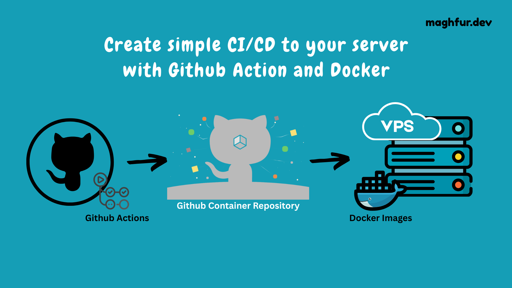

# Simple CI/CD Pipeline with Github Action and Private Server

This repository is an example of how to create a CI/CD pipeline using Github Actions to deploy a Go application to a private server using an image from the Github Container Registry (GHCR).

The pipeline consists of the following steps:

1. Checkout code in the workflow's workspace
2. Set up Go environment
3. Set up Docker Buildx
4. Login to GHCR
5. Build and push image to GHCR
6. Deploy to server

The code in this repository is a simple "Hello World" Go application that listens on port 3000 and returns a JSON response with a message when the "/hi" endpoint is accessed.

## How to use

1. Create a new repository
2. Copy the contents of this repository to the new repository
3. Update the `Dockerfile` and `main.go` files as needed
4. Create a new file named `deploy.yml` in the `.github/workflows` directory
5. Copy the contents of the `deploy.yml` file from this repository to the new file
6. Update the `deploy.yml` file as needed
7. Commit and push the changes
8. Create a new secret named `GHCR_TOKEN` in the repository settings
9. Create a new secret named `SSH_HOST` in the repository settings
10. Create a new secret named `SSH_USER` in the repository settings
11. Create a new secret named `SSH_KEY` in the repository settings
12. Trigger the workflow by pushing changes to the repository

Created by Hanif Maghfur
